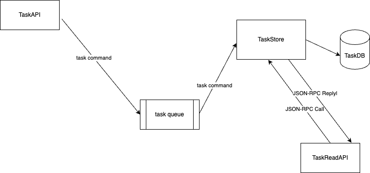

# Task Distributor

Tiny example to show CQRS implementation using Go.


## Design

Tiny design of the "system" with main components and interactions in between




## MicroServices

- [TaskAPI](taskApi/README.md) - command API for sending tasks and updating them 
- [TaskStore](taskStore/README.md) - service accepting commands via RabbitMQ and saving it to DB. Exposes JSON-RPC API for reading
- [TaskReadAPI](taskReadApi/README.md) - service reading tasks from store
- [TaskData](taskData/README.md) - common data structures

## Build and run
Each module has its makefile.

list of commands:
1. make fmt
2. make test
3. make build
4. make install
5. make get
6. make swagger - builds swagger schema
7. make mocks - generates mocks 

make mocks example usage
```
make mocks SOURCE=service/taskService.go DESTINATION=service/taskService_mock.go PACKAGE=service
```

Both require mockgen and swag installed to the system via go install

## External services

1. RabbitMQ - runs on default port with credentials "admin:admin217"
2. MariaDB - runs on default port with credentials "root:root4db"

## Health
Each microservice has /health endpoint to make sure it started 